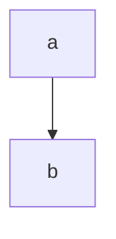

---
# try also 'default' to start simple
theme: default
# random image from a curated Unsplash collection by Anthony
# like them? see https://unsplash.com/collections/94734566/slidev
background: https://source.unsplash.com/collection/94734566/1920x1080
# apply any windi css classes to the current slide
class: 'text-center'
# https://sli.dev/custom/highlighters.html
highlighter: shiki
# show line numbers in code blocks
lineNumbers: false
# some information about the slides, markdown enabled
info: |
  ## Slidev Starter Template
  Presentation slides for developers.

  Learn more at [Sli.dev](https://sli.dev)
# persist drawings in exports and build
drawings:
  persist: false
# page transition
transition: slide-left
# use UnoCSS
css: unocss
---

# Welcome to Slidev

hello world


---

# This is cool
<!--slide 1-->


- point 1
- point 2
- point 3



---

# Slide 2
<!--slide 2-->


Learn more about this topic here.

```go
func main() {
  fmt.Println("hello world")
}
```


---

# Slide 3


Testing **bold**, _italic_.
